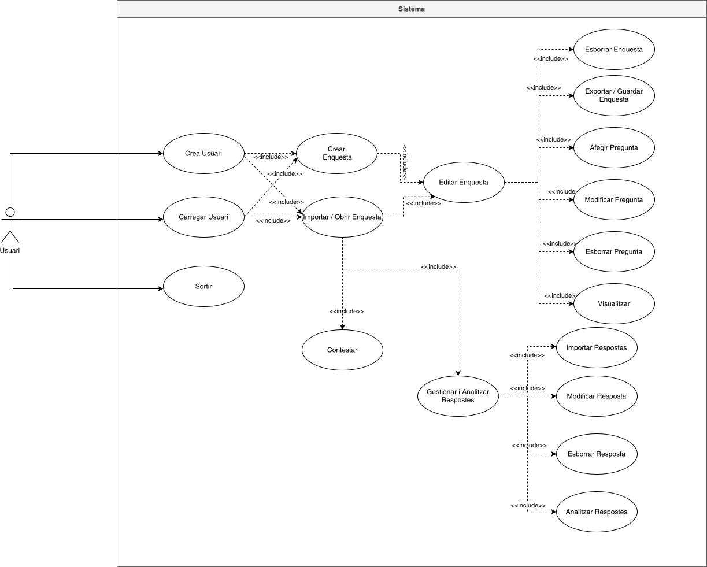
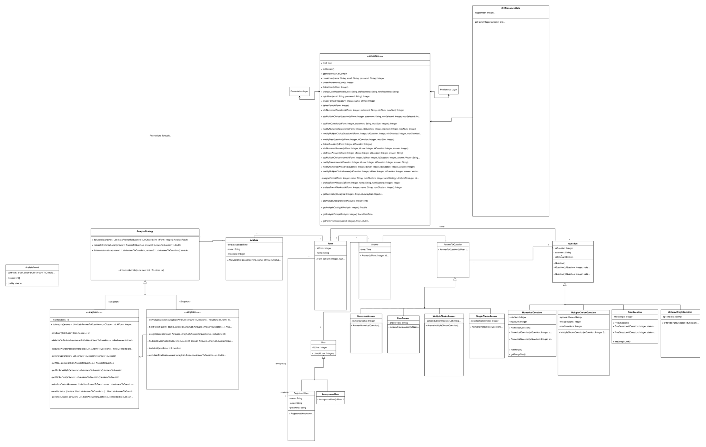
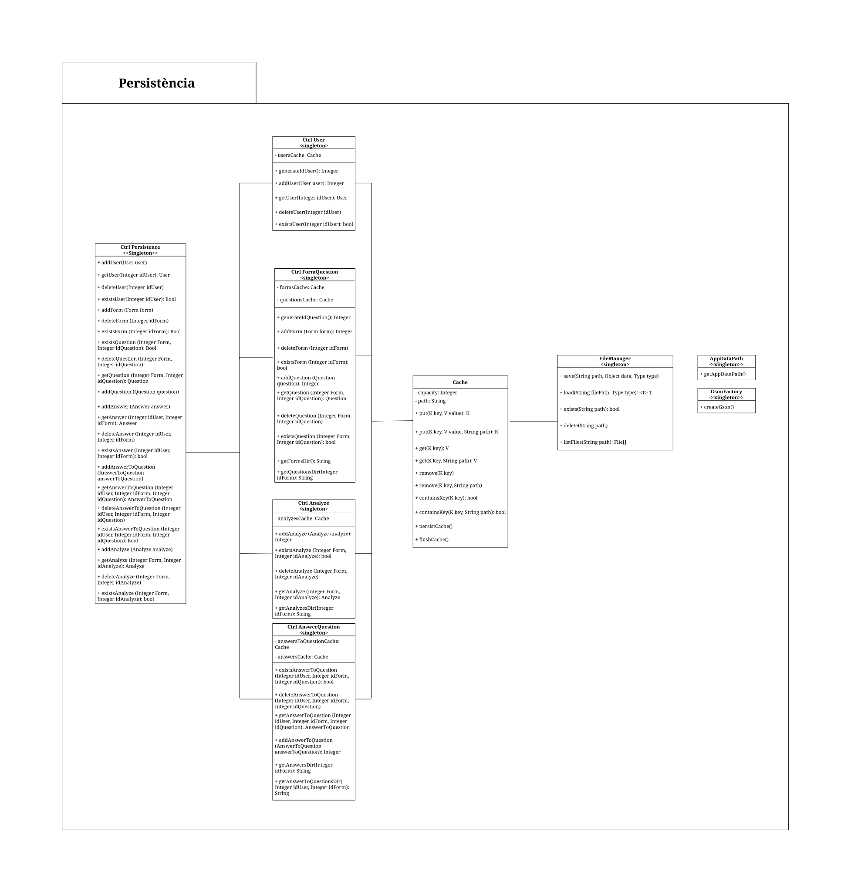
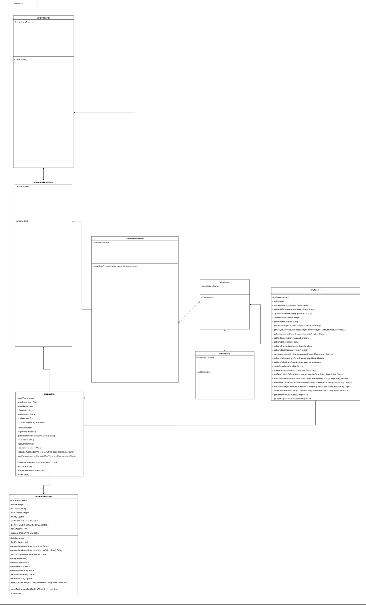

<div align="center">

# 📝 FORM BUILDER
### Crea · Contesta · Analitza

**Aplicación de escritorio en Java para crear formularios, recoger respuestas y descubrir patrones con clustering**


**`PROP · Primavera 2025-26 · Subgrup 13.3 · UPC`**

[🚀 Inicio rápido](#-inicio-rápido) · [✨ Funcionalidades](#-funcionalidades) · [🏗️ Arquitectura](#️-arquitectura) · [📁 Estructura](#-estructura-del-repo) · [📚 Docs](#-documentación) · [👥 Equipo](#-equipo)

</div>

---

## ✨ Funcionalidades

| | Módulo | Qué hace |
|---|---|---|
| 📋 | **Crear / Editar formularios** | Formularios con título, descripción y preguntas ordenadas (`VistaCrearEditarForm`) |
| ❓ | **4 tipos de pregunta** | `Libre` ✍️ · `Numérica` 🔢 · `Selección única` 🔘 · `Selección múltiple` ☑️ (+ ordenada) |
| 🙍‍♂️🙍‍♀️ | **Contestar** | Como usuario registrado o anónimo (`VistaContestar`, `AnonymousUser` / `RegisteredUser`) |
| 🔐 | **Login / Registro** | Alta, inicio de sesión y menú principal (`LoginView`, `SignUpView`, `MainMenuView`) |
| 📊 | **Analizar respuestas** | Clustering **K-Means** y **K-Medoids** + métrica de calidad (`VistaAnalitzar`, `VistaResultatsAnalisis`) |
| 💾 | **Persistencia JSON** | Guardado automático con Gson + caché (`CtrlPersistence`, `FileManager`, `Cache`) |
| 🧪 | **Drivers + Tests** | `Driver` interactivo para probar dominio + tests JUnit / Mockito |

---

## 🚀 Inicio rápido

> Requisito: **Java 21** (el toolchain de Gradle lo gestiona solo).

### Opción A — Ejecutable (lo más fácil) ⚡

```bash
java -jar EXE/form-builder.jar
```

### Opción B — Desde código fuente 🛠️

```bash
cd FONTS

./gradlew run        # ▶️ ejecutar la app
./gradlew test       # ✅ correr los tests
./gradlew jar        # 📦 regenera EXE/form-builder.jar (fat-jar)
./gradlew javadoc    # 📖 genera DOCS/javadoc/
./gradlew clean      # 🧹 limpia compilados y artefactos
```

> En Windows usa `gradlew.bat` en lugar de `./gradlew`.

---

## 🏗️ Arquitectura

Arquitectura en 3 capas: **Presentación → Dominio → Persistencia**

| Capa | Paquete | Clases clave |
|---|---|---|
| 🖥️ Presentación | `presentation` | `Main`, `CtrlPresentation`, `Vista*`, `LoginView`, `SignUpView`, `MainMenuView` |
| ⚙️ Dominio | `domain`, `domaincontrollers` | `Form`, `Question`, `Answer*`, `Analyze`, `KMeansStrategy`, `KMedoidsStrategy`, `CtrlDomain`, `CtrlTransformData` |
| 💾 Persistencia | `persistence` | `CtrlPersistence`, `CtrlUser`, `CtrlFormQuestion`, `CtrlAnswerQuestion`, `CtrlAnalyze`, `Cache`, `FileManager`, `GsonFactory` |
| 🧰 Utils / Drivers | `utils`, `drivers` | `DoubleKey`, `TripleKey`, excepciones, `Driver` |

### 🎯 Casos de uso



### ⚙️ Modelo de dominio (diseño)



<details>
<summary>💾 <b>Modelo de persistencia (clic para ver)</b></summary>
<br>



</details>

<details>
<summary>🖥️ <b>Modelo de presentación (clic para ver)</b></summary>
<br>



</details>

### ❓ Tipos de pregunta y respuesta

| Pregunta | Respuesta | Notas |
|---|---|---|
| ✍️ `FreeQuestion` | `AnswerFreeQuestion` | Texto libre |
| 🔢 `NumericalQuestion` | `AnswerNumericalQuestion` | Valor numérico (distancia euclídea en análisis) |
| 🔘 `SingleChoice` / ordenada | `AnswerSingleChoiceQuestion` | Una opción (`OrderedSingleQuestion` pondera el orden) |
| ☑️ `MultipleChoiceQuestion` | `AnswerMultipleChoiceQuestion` | Varias opciones (distancia Jaccard / coseno) |

### 📊 Análisis — K-Means vs K-Medoids

| | **K-Means** `KMeansStrategy` | **K-Medoids** `KMedoidsStrategy` |
|---|---|---|
| Centroide | Media (punto sintético) | Medoide (usuario real) |
| Velocidad | ⚡ Rápido | 🐢 Más costoso pero robusto |
| Outliers | Sensible | Resistente |
| Base común | `AnalyzeStrategy`: distancia Manhattan entre usuarios + calidad del clustering | ← igual |

---

## 📁 Estructura del repo

```
📦 subgrup-prop13.3/
├── 📖 README.md                  ← estás aquí
├── 👥 membres.txt                ← equipo + emails
├── 🧩 relacio_classes_membres.txt ← quién hizo cada clase
├── 🗺️ index.txt                  ← mapa del repo
│
├── 📚 DOCS/
│   ├── 📄 documentacio.pdf       ← decisiones, algoritmos y EDs
│   ├── 📘 manual_usuari.pdf      ← guía paso a paso
│   ├── 🧪 javadoc/               ← API generada
│   └── 🎨 *.svg                  ← casos de uso + modelos conceptuales
│       ├── diagrama_casos_us.svg
│       ├── diagrama_model_conceptual_domini_disseny.svg
│       ├── diagrama_model_conceptual_persistencia_disseny.svg
│       └── diagrama_model_conceptual_presentacio_disseny.svg
│
├── ⚡ EXE/
│   ├── 📦 form-builder.jar       ← java -jar EXE/form-builder.jar
│   └── 🧪 jocs_prova.pdf        ← juegos de prueba
│
└── 💻 FONTS/                     ← código Gradle (Java 21)
    ├── 🔧 build.gradle / settings.gradle / gradle.properties
    ├── ▶️ gradlew / gradlew.bat
    └── 📂 src/
        ├── main/java/  presentation/ domain/ domaincontrollers/ persistence/ drivers/ utils/
        └── test/       ← JUnit + Mockito + System-Stubs
```

---

## 📚 Documentación

| Documento | Ruta | Contenido |
|---|---|---|
| 📄 Decisiones de diseño | `DOCS/documentacio.pdf` | Algoritmos, EDs, trade-offs |
| 📘 Manual de usuario | `DOCS/manual_usuari.pdf` | Uso paso a paso con capturas |
| 🧪 Juegos de prueba | `EXE/jocs_prova.pdf` | Casos de prueba del programa |
| 📖 Javadoc | `DOCS/javadoc/` | API (`./gradlew javadoc` para regenerar) |
| 🎨 Diagramas | `DOCS/*.svg` | Ver sección [🏗️ Arquitectura](#️-arquitectura) |

---

## 🧪 Tests

```bash
cd FONTS
./gradlew test
```

Stack: `JUnit 4.13.2` · `Mockito 5.21.0` · `System-Stubs 2.1.8` · `Gson 2.13.2`

---

## 👥 Equipo — Subgrup 13.3

| Miembro | Email | Clases principales |
|---|---|---|
| 🧑‍💻 Joel Forcadell Moral | joel.forcadell@estudiantat.upc.edu | `User`, `RegisteredUser`, `AnonymousUser`, `Answer`, `VistaContestar`, `VistaCrearEditarForm` |
| 🧑‍💻 Samuel Gil Martin | samuel.gil@estudiantat.upc.edu | Preguntas y respuestas (`Question*`, `Answer*`), `LoginView`, `SignUpView`, `MainMenuView` |
| 🧑‍💻 Artur Leivar Guiu | artur.leivar@estudiantat.upc.edu | `CtrlDomain`, `CtrlPersistence`, `Cache`, `CtrlAnalyze`, `CtrlAnswerQuestion`, utils y excepciones |
| 🧑‍💻 Tomeu Mestre Tugores | tomeu.mestre@estudiantat.upc.edu | `KMedoidsStrategy`, `Analyze`, `Form`, `FileManager`, `GsonFactory`, `CtrlUser`, `CtrlFormQuestion` |
| 🧑‍💻 Pau Turro Gomez | pau.turro.gomez@estudiantat.upc.edu | `KMeansStrategy`, `Driver`, `VistaAnalitzar`, `VistaResultatsAnalisis` |

<details>
<summary>🤝 <b>Trabajo colaborativo</b></summary>

- **`AnalyzeStrategy`** (clase padre de K-Means / K-Medoids) — Pau (distancias locales) + Tomeu (Manhattan entre usuarios, calidad del clustering, excepciones).
- **`CtrlPresentation`** — Artur + Samuel + Joel + Pau (métodos compartidos vistas/controladores).
- **`CtrlTransformData`** — Artur + Joel + Pau (métodos compartidos controladores/vistas).

Ver detalle en `relacio_classes_membres.txt`.

</details>

---

<div align="center">

**🎓 PROP · Projecte de Programació — FIB, UPC**
*Q25-26 Primavera · Subgrup 13.3*

⭐ Si te sirve el proyecto, deja una estrella ⭐

</div>
